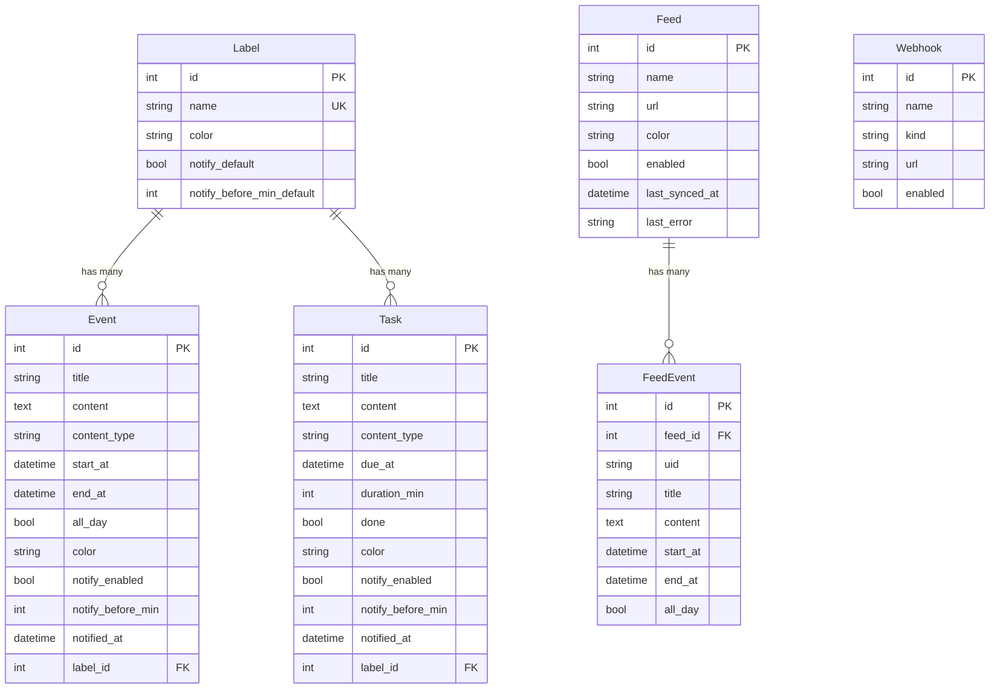

# harosystem

セルフホスト型のカレンダー Web アプリケーション。サイバーパンク風ネオンテーマの UI で、Google Calendar の代替として Docker 一発で立ち上げられます。

ライト / ダーク / システム依存の外観モードと、モードごとに選べる 6 種のテーマ (NEØN / SYNTHWAVE / MATRIX / PAPER / SAKURA / MINT) を搭載。

## ✨ 機能

### カレンダー
- **日 / 週 / 月表示** の切り替え（矢印キー・ホイール操作対応）
- イベントのドラッグ移動・リサイズ（15 分スナップ）
- 空きスロットクリック / セルのダブルクリックで即座に作成
- 現在時刻インジケーター・終日イベント対応

### イベント & タスク
- **イベント**: 日時指定のカレンダーエントリ
- **タスク**: 期限日・所要時間付きの TODO アイテム
- **Markdown サポート**: 本文に Markdown を使用可能。タスク内のチェックボックスはサイドバーにサブタスクとして表示・操作可能
- **ラベル (プロジェクト)**: 色・デフォルト通知設定付きのカテゴリ分類
- **個別カラー**: イベント / タスクごとに 22 色のパレットから色をオーバーライド可能

### テーマ
- ライト / ダーク / システム依存の外観モード
- ダークテーマ: NEØN / SYNTHWAVE / MATRIX
- ライトテーマ: PAPER / SAKURA / MINT

### 外部カレンダー連携
- **ICS フィード購読**: 外部カレンダー（Google Calendar 祝日など）を購読
- `webcal://` URL の自動変換、定期同期（デフォルト 5 分間隔）
- フィードごとの表示 / 非表示切り替え

### 通知
- **ブラウザ通知**: イベント / タスクの開始前 N 分にデスクトップ通知
- **Webhook 連携**: Discord / Slack / カスタム URL への通知（テスト送信機能付き）

### データ管理
- **ICS インポート / エクスポート**: 標準 iCalendar 形式でバックアップ・移行

## 🏗️ アーキテクチャ

```
┌─────────────────┐      ┌──────────────────────┐      ┌──────────────┐
│   Browser        │      │   Nginx              │      │  PostgreSQL  │
│   Angular 18     │─────▶│   :443 (HTTPS/TLS)   │      │  16-alpine   │
│                  │      │   :80 → 301 → :443   │      │              │
│                  │      │   /api → :8000       │──┐   │              │
└─────────────────┘      └──────────────────────┘  │   └──────────────┘
                                                    │          ▲
                                                    ▼          │
                                              ┌─────────────────┐
                                              │  FastAPI (:8000) │
                                              │  + Background    │
                                              │    - Feed sync   │
                                              │    - Notify loop │
                                              └─────────────────┘
```

| レイヤー | 技術 |
|---------|------|
| Frontend | Angular 18 (Standalone Components, Signals), Tailwind CSS 3, Angular Material |
| Backend | FastAPI, SQLAlchemy 2.0, Pydantic v2, Python 3.12 |
| Database | PostgreSQL 16 |
| Infra | Docker Compose, Nginx (HTTPS / 自己署名証明書) |

## 🚀 セットアップ

### 前提条件
- Docker & Docker Compose

### 起動

```bash
git clone <repository-url>
cd harosystem

# 1. 環境変数ファイルを作成し、認証情報を設定する
cp .env.example .env
# .env を編集して POSTGRES_PASSWORD を強力なものに変更

# 2. ビルドして起動
docker compose up --build -d
```

ブラウザで `https://localhost:4443` にアクセス（自己署名証明書のため警告が出ます）。
`http://localhost:4200` は HTTPS へ自動リダイレクトされます。

### 停止 / リセット

```bash
docker compose down       # 停止
docker compose down -v    # データ (pgdata ボリューム) も削除して完全リセット
```

## 🔒 セキュリティに関する注意事項

このアプリは **個人のローカル環境 / 信頼できる LAN 内での利用** を想定しています。インターネットへ公開する場合は以下を必ず確認してください。

- **認証機能はありません。** 公開する場合はリバースプロキシでの Basic 認証、VPN (Tailscale / WireGuard 等)、または認証プロキシ (Authelia 等) を前段に置いてください
- **`.env` を必ず作成し、強力な DB パスワードを設定してください。** 認証情報のデフォルト値はソースコードに含まれていません（未設定の場合は起動に失敗します）
- **`.env` や証明書ファイルをコミットしないでください**（`.gitignore` 済み）
- 同梱の TLS 証明書は **自己署名** です。公開時は Let's Encrypt 等の正規証明書に差し替えてください
- Webhook URL（Discord / Slack）はシークレットを含みます。DB バックアップの取り扱いに注意してください

## 📡 API リファレンス

ベース URL: `https://localhost:4443/api`

```
GET /api/health → {"status": "ok"}
```

| リソース | パス | メソッド |
|---------|------|---------|
| ラベル | `/api/labels`, `/api/labels/{id}` | GET, POST, PUT, DELETE |
| イベント | `/api/events`, `/api/events/{id}` | GET, POST, PUT, DELETE |
| タスク | `/api/tasks`, `/api/tasks/{id}` | GET, POST, PUT, DELETE |
| フィード | `/api/feeds`, `/api/feeds/{id}`, `/api/feeds/{id}/sync` | GET, POST, PUT, DELETE |
| フィードイベント | `/api/feeds/events` | GET |
| Webhook | `/api/webhooks`, `/api/webhooks/{id}`, `/api/webhooks/{id}/test` | GET, POST, PUT, DELETE |
| ICS | `/api/ics/export`, `/api/ics/import` | GET, POST (multipart) |

イベント / タスクの一覧は `start`, `end`, `label_id` クエリでフィルタできます。

<details>
<summary>イベント作成リクエスト例</summary>

```json
{
  "title": "キックオフMTG",
  "content": "# アジェンダ\n- 進捗確認\n- 次のマイルストーン",
  "content_type": "md",
  "start_at": "2026-06-11T10:00:00+09:00",
  "end_at": "2026-06-11T11:30:00+09:00",
  "label_id": 1,
  "color": "#a78bfa"
}
```
</details>

## 🗄️ データモデル



## ⚙️ 設定

### 環境変数 (`.env`)

| 変数 | 説明 |
|------|------|
| `POSTGRES_USER` | PostgreSQL ユーザー名 |
| `POSTGRES_PASSWORD` | PostgreSQL パスワード（**必ず変更すること**） |
| `POSTGRES_DB` | データベース名 |

バックエンドの `DATABASE_URL` は docker-compose.yml が上記から自動構築します。
いずれも未設定の場合、起動時にエラーで停止します（フェイルファスト）。

### フロントエンド設定（ブラウザ内、Settings ページ）

| 項目 | デフォルト | 説明 |
|------|-----------|------|
| 外観モード | システム | ライト / ダーク / システム依存 |
| テーマ | NEØN (ダーク) / PAPER (ライト) | モードごとに選択可能 |
| 表示開始 / 終了時間 | 7:00 / 22:00 | タイムグリッドの表示範囲 |
| スロット高さ | 60px | 1 時間あたりのピクセル高さ |
| 週の開始曜日 | 日曜日 | 月曜始まりに変更可能 |
| 通知 | 有効 | ブラウザ通知の ON/OFF とデフォルトタイミング |
| 自動更新間隔 | — | 外部カレンダー変更の定期再取得 |

## 🔧 開発

```bash
# フロントエンドテスト
cd frontend && npx jest

# バックエンド構文チェック
cd backend && python -m py_compile app/main.py app/models.py app/schemas.py

# ログ確認
docker compose logs -f
```

### ネットワーク設定

Docker ネットワークの MTU は 1400 に設定されています（`docker-compose.yml`）。
ホストのアップリンクが MTU 1400（USB テザリング等）の場合に TLS ハンドシェイクのパケットロスを防ぐためです。通常の環境では削除しても問題ありません。

## 📄 ライセンス

[MIT License](LICENSE)
